# symphon — Internal Algorithm Flowcharts

This document provides detailed Mermaid flowcharts for the four core algorithms
implemented in the `symphon` package.

---

## 1. Mulliken Irrep Labels (Gamma-point)

Entry point: `IrRepsEigen.run()` in `symphon/irreps/core.py`.
Mulliken labels are only produced when `phonopy`'s built-in character table
covers the point group of the little co-group at **q**.

```mermaid
flowchart TD
    A([IrRepsEigen.run&#40;qpoint, kpname&#41;]) --> B

    B["Symmetry&#40;primitive, symprec&#41;.dataset\n→ _symmetry_dataset\n  .rotations, .international, .number"]
    B --> C{is_primitive_cell&#40;rotations&#41;?}
    C -- No --> RAISE[raise RuntimeError\n'Non-primitive cell']
    C -- Yes --> D

    D["_get_rotations_at_q&#40;&#41;\n→ _rotations_at_q, _translations_at_q\n  &#40;little co-group of q&#41;"]
    D --> E["_g = len&#40;_rotations_at_q&#41;"]
    E --> F["spglib.get_pointgroup&#40;_rotations_at_q&#41;\n→ _pointgroup_symbol"]
    F --> G["_get_conventional_rotations&#40;&#41;\n→ _transformation_matrix, _conventional_rotations"]
    G --> H["_get_ground_matrix&#40;&#41;\n→ _ground_matrices\n  &#40;representation matrices on eigenvectors&#41;"]
    H --> I["_get_degenerate_sets&#40;&#41;\n= get_degenerate_sets&#40;_freqs, cutoff=degeneracy_tolerance&#41;\n→ _degenerate_sets\n  &#40;list of index groups&#41;"]
    I --> J["_get_irreps&#40;&#41;  →  _irreps\n_get_characters&#40;&#41;  →  _characters, _irrep_dims"]

    J --> K{_pointgroup_symbol\nin character_table\nand not None?}
    K -- No --> K_MISS["_rotation_symbols = None\n[log: 'Point group not in database']"]
    K -- Yes --> L

    L["_get_rotation_symbols&#40;_pointgroup_symbol&#41;\n→ _rotation_symbols,\n   character_table_of_ptg\n   &#40;matches actual rotations to classes&#41;"]
    L --> M{_rotation_symbols\nfound?}

    M -- No --> M_MISS["[log: 'Database not prepared']\n_ir_labels = None"]
    M -- Yes --> N["_character_table = character_table_of_ptg\n_ir_labels = _get_irrep_labels&#40;_character_table&#41;\n→ list indexed by degenerate-set idx\n  e.g. [&#40;'A1g',&#41;, &#40;'Eg',&#41;, ...]"]

    N --> O{abs&#40;qpoint&#41; < symprec\n&#40;Gamma point?&#41;}
    O -- No --> P_NONGAMMA["[log: 'Non-Gamma: Mulliken labels stored\nbut IR/Raman skipped']\n_RamanIR_labels = None"]
    O -- Yes --> P["_RamanIR_labels = _get_infrared_raman&#40;&#41;\n→ &#40;ir_active_set, raman_active_set&#41;"]

    subgraph get_summary_table ["get_summary_table&#40;&#41;"]
        Q["Build mode_to_degset map\nfrom _degenerate_sets"]
        Q --> R["For each band_index:\n  set_idx = mode_to_degset[band_index]\n  label = _ir_labels[set_idx][0]"]
        R --> S["Propagate labels within\ndegenerate sets\n&#40;all members share same label&#41;"]
        S --> T["Lookup is_ir_active:\n  label in ir_active_map?\nLookup is_raman_active:\n  label in raman_active_map?"]
    end

    P --> get_summary_table
    P_NONGAMMA --> get_summary_table
    K_MISS --> get_summary_table
    M_MISS --> get_summary_table
```



**Key data structures**

| Name | Type | Description |
|---|---|---|
| `_degenerate_sets` | `list[tuple[int]]` | Groups of mode indices with near-degenerate frequencies |
| `_ir_labels` | `list[tuple[str]]` | One entry per degenerate set; each is a tuple of candidate label strings |
| `_rotation_symbols` | `list[str]` | Symmetry-class labels matched to actual rotation matrices |
| `_character_table` | `dict` | phonopy character table entry: `character_table`, `mapping_table`, etc. |

---

## 2. IR and Raman Activity

Entry point: `IrRepsEigen._get_infrared_raman()` — called inside `run()` **only
at the Gamma point** (`abs(qpoint) < symprec`), and only when `_character_table`
is available.

```mermaid
flowchart TD
    A([_get_infrared_raman&#40;&#41;]) --> B{_pointgroup_symbol\nin character_table?}
    B -- No --> RET0[return &#40;empty_set, empty_set&#41;]
    B -- Yes --> C{_character_table\nnot None?}
    C -- No --> RET0
    C -- Yes --> D

    D["mapping = _character_table['mapping_table']\n  keys   → class names\n  values → list of 3×3 rotation matrices"]
    D --> E["Initialise:\n  g = 0\n  chi_ir_class = []\n  chi_raman_class = []"]

    E --> LOOP_CLASSES

    subgraph LOOP_CLASSES ["Loop over symmetry classes"]
        F["ops = mapping[op_class]"]
        F --> G["g += len&#40;ops&#41;"]
        G --> H["R = np.array&#40;ops[0]&#41;\n  &#40;representative matrix&#41;"]
        H --> I["tr_R = np.trace&#40;R&#41;\n  &#40;character of polar-vector rep&#41;"]
        I --> J["chi_ir_class.append&#40;tr_R&#41;"]
        J --> K["chi_raman_class.append&#40;\n  0.5 * &#40;tr_R² + Tr&#40;R²&#41;&#41;\n&#41;\n  &#40;character of sym. rank-2 tensor&#41;"]
    end

    LOOP_CLASSES --> LOOP_IRREPS

    subgraph LOOP_IRREPS ["Loop over irrep labels in character_table"]
        L["label, irrep_chars =\n  _character_table['character_table'].items&#40;&#41;"]
        L --> M["Initialise n_ir = 0, n_ram = 0"]
        M --> INNER

        subgraph INNER ["Inner loop over classes"]
            N["degen = len&#40;mapping[op_class]&#41;"]
            N --> O["n_ir  += conj&#40;irrep_chars[iclass]&#41;\n         * chi_ir_class[iclass] * degen"]
            O --> P["n_ram += conj&#40;irrep_chars[iclass]&#41;\n         * chi_raman_class[iclass] * degen"]
        end

        INNER --> Q["n_ir  = |n_ir|  / g\nn_ram = |n_ram| / g"]
        Q --> R{n_ir > 0.5?}
        R -- Yes --> S["ir_active.add&#40;label&#41;"]
        R -- No --> T{n_ram > 0.5?}
        S --> T
        T -- Yes --> U["raman_active.add&#40;label&#41;"]
        T -- No --> LOOP_IRREPS
        U --> LOOP_IRREPS
    end

    LOOP_IRREPS --> V["return &#40;ir_active, raman_active&#41;\n→ stored as _RamanIR_labels"]

    V --> W["In get_summary_table&#40;&#41;:\n  Build ir_active_map / raman_active_map\n  For each mode: is_ir_active = label in ir_active_map"]
```

**Note:** The trace `Tr(R)` is basis-invariant, so the fractional-coordinate
matrices in `mapping_table` give identical results to Cartesian matrices.

---

## 3. BCS Labels (irrep backend)

Entry point: `IrRepsEigen.run()` always launches `IrRepsIrrep` after the phonopy
step.  The full implementation is in `symphon/irreps/backend.py`.

```mermaid
flowchart TD
    A([IrRepsEigen.run&#40;&#41; calls\nIrRepsIrrep.run&#40;kpname&#41;]) --> B

    B{HAS_IRREP?}
    B -- No --> IMPORT_ERR["raise ImportError\n'irrep package required'"]
    B -- Yes --> C

    C["SpaceGroupIrreps.from_cell&#40;\n  cell, spinor=False,\n  search_cell=True, symprec\n&#41;  →  sg"]
    C --> D["sg.name  → _spacegroup_symbol\nsg.number_str.split&#40;'.'&#41;[0]  → _spacegroup_number\ndegenerate_sets&#40;freqs&#41;  → _degenerate_sets\nspglib.get_pointgroup&#40;sg.symmetries&#41;  → _pointgroup_symbol"]

    D --> E["IrrepTable&#40;sg.number_str, spinor=False&#41;  →  table\nrefUC = sg.refUC\nrefUCTinv = inv&#40;refUC.T&#41;"]
    E --> F["q_bcs = refUC.T @ q_input\n  &#40;q in BCS reciprocal coords&#41;"]

    F --> G

    subgraph KPOINT_SEARCH ["Search BCS table for kpname"]
        G["For each irr in table.irreps:\n  k_prim = refUCTinv @ irr.k\n  diff = k_prim - q_input\n  if allclose&#40;diff - round&#40;diff&#41;, 0, atol=1e-4&#41;:\n    found_kpname = irr.kpname\n    break"]
    end

    G --> H{found_kpname?}
    H -- Yes --> I["kpname = found_kpname\n_bcs_kpname = found_kpname"]
    H -- No --> J{q ≈ 0\n&#40;Gamma&#41;?}
    J -- Yes --> I2["kpname = 'GM'"]
    J -- No --> RAISE2["raise ValueError\n'Could not identify BCS label'"]

    I --> K["sg.get_irreps_from_table&#40;kpname, q_input&#41;\n→ bcs_table\n  &#40;dict: label → &#123;op_index: char&#125;&#41;"]
    I2 --> K

    K --> L["Detect only_multidim:\n  min_irrep_dim = min dim across bcs_table\n  only_multidim = &#40;min_irrep_dim > 1&#41;"]
    L --> M{only_multidim\nand dim == 2?}
    M -- Yes --> N["Force-pair consecutive modes:\n  _degenerate_sets = [&#40;0,1&#41;, &#40;2,3&#41;, ...]"]
    M -- No --> O
    N --> O

    O["_calculate_phonon_representations&#40;sg&#41;\n→ block_matrices, little_group_indices"]

    subgraph PHONON_REP ["_calculate_phonon_representations detail"]
        P["Find little group:\n  For each sym in sg.symmetries:\n    dq = R @ q - q\n    if dq mod 1 ≈ 0 → append to little_group_indices"]
        P --> Q{is Gamma?}
        Q -- Yes --> R1["positions_work = positions\nq_work = q\nL_bcs = L"]
        Q -- No --> R2["positions_bcs = inv&#40;refUC&#41; @ &#40;pos - shiftUC&#41;\npositions_work = positions_bcs mod 1\nq_work = refUC.T @ q\nL_bcs = L @ refUC"]
        R1 --> S["For each little-group op:\n  rot_work, trans_work\n  R_cart = L_bcs.T @ rot_work @ inv&#40;L_bcs&#41;.T\n  Compute atom permutation + phases\n  phase = exp&#40;2πi q_work · L_vec&#41;\n  &#40;r-gauge, default&#41;"]
        R2 --> S
        S --> T["For each degenerate block:\n  M&#40;g&#41;_mn = Σ_k phase_k · e*_m&#40;perm&#40;k&#41;&#41; · R_cart · e_n&#40;k&#41;"]
    end

    O --> PHONON_REP
    PHONON_REP --> U

    subgraph LABEL_MATCH ["Label matching loop"]
        U["For each degenerate block:"]
        U --> V["bcs_indices = little_group_indices + 1\n&#40;1-based BCS op indices&#41;"]
        V --> W["For each label in bcs_table:\n  overlap = Σ_{i_lg} conj&#40;table_char[i_bcs]&#41; · Tr&#40;M&#40;g&#41;&#41;\n  n = overlap / |little_group|\n  Track best_match_label, max_overlap"]
        W --> X{max_overlap >\nthreshold?\n&#40;0.8 at Γ, 0.5 else&#41;}
        X -- No --> Y["label = None\nopd  = None"]
        X -- Yes --> Z["best_match_label found\nTry to solve OPD:"]
        Z --> AA{HAS_SPGREP?}
        AA -- No --> BB["opd = None"]
        AA -- Yes --> CC["_get_reference_matrices&#40;sg, little_group_indices, label&#41;\n  → spgrep irrep matrices D&#40;g&#41;\n  matching BCS label by character overlap ≥ 0.9"]
        CC --> DD["_solve_unitary_mapping&#40;D, M&#41;\n  U = 1/g Σ_g D&#40;g&#41; X M&#40;g&#41;†\n  SVD → unitary U\n  if min singular value < 1e-4 → U = None"]
        DD --> EE["opds[i] = opd_to_symbolic&#40;U[:,i]&#41;\n  for each mode i in block"]
        BB --> FF
        EE --> FF["Append &#123;label, opd&#125; per mode in block\n→ _irreps"]
    end

    LABEL_MATCH --> GG["Back in IrRepsEigen.run&#40;&#41;:\n  _irrep_labels_bcs = [irr['label'] for irr in _irrep_backend_obj._irreps]\n  _irrep_opds_bcs   = [irr['opd']   for irr in _irrep_backend_obj._irreps]"]

    GG --> HH["In get_summary_table&#40;&#41; / format_summary_table&#40;&#41;:\n  label_bcs = _irrep_labels_bcs[band_index]\n  Displayed in label&#40;BCS&#41; column"]
```



---

## 4. Chiral Phase Transitions

Entry point: `ReportingMixin._compute_chiral_transitions()` — called from
`IrRepsEigen.run()` only when `self._compute_chiral == True`.

```mermaid
flowchart TD
    A([_compute_chiral_transitions&#40;&#41;]) --> B{_spacegroup_number\nknown?}
    B -- No --> SKIP0["_chiral_transitions_map = &#123;&#125;\nreturn"]
    B -- Yes --> C{is_sohncke&#40;spg_number&#41;?}
    C -- Yes --> SKIP1["parent already chiral\n_chiral_transitions_map = &#123;&#125;\nreturn"]
    C -- No --> D

    D["ChiralTransitionFinder&#40;spg_number, symprec&#41;"]
    D --> E["finder.find_chiral_transitions&#40;\n  qpoint=q, qpoint_label=kpname\n&#41;"]

    subgraph FINDER ["ChiralTransitionFinder.find_chiral_transitions&#40;&#41;"]
        F["_load_spacegroup_info&#40;&#41;\n  Iterate Hall numbers via spglib\n  Collect SpaceGroupInfo:\n    rotations, translations,\n    primitive ops, order"]
        F --> G{qpoint provided?}
        G -- Yes --> H["use provided qpoint"]
        G -- No --> I["get_special_qpoints via IrrepTable\n  → list of &#40;kpname, q&#41; pairs"]
        H --> J
        I --> J

        J["For each q-point:"]
        J --> K["get_irreps_at_qpoint&#40;qp, label&#41;"]

        subgraph GET_IRREPS ["get_irreps_at_qpoint detail"]
            K1{HAS_SPGREP?}
            K1 -- Yes --> K2["get_spacegroup_irreps_from_primitive_symmetry&#40;\n  prim_rots, prim_trans, q_prim\n&#41;  →  small rep matrices\nLabel via character overlap with IrrepTable"]
            K1 -- No --> K3["Fallback: IrrepTable characters only\n&#40;1D irreps only&#41;"]
        end

        K --> GET_IRREPS
        GET_IRREPS --> L["For each irrep:"]

        subgraph ISOTROPY ["Enumerate isotropy subgroups"]
            L1{irrep dim == 1?}
            L1 -- Yes --> L2["isotropy = ops where |char - 1| < 1e-5\nOPD = &#40;a&#41;  &#40;scalar, up to sign&#41;"]
            L1 -- No --> L3{HAS_SPGREP_MODULATION?}
            L3 -- Yes --> L4["IsotropyEnumerator&#40;irrep_mats&#41;\n→ maximal isotropy subgroups + OPDs"]
            L3 -- No --> L5["skip higher-D irrep"]
        end

        L --> ISOTROPY
        ISOTROPY --> M["Also:\n_enumerate_multi_k_isotropy_subgroups&#40;&#41;\n  &#40;zone-boundary star arms&#41;"]

        M --> N["For each isotropy subgroup / OPD:"]

        subgraph DAUGHTER ["_identify_daughter_spacegroup&#40;&#41;"]
            N1["Build supercell lattice matrix\n  diagonal from q denominators\n  &#40;e.g. q=&#40;0,0,½&#41; → [1,1,2] supercell&#41;"]
            N1 --> N2["For each parent op:\n  Apply op + lattice translations\n  Check if isotropy constraint D&#40;g&#41;·v = v holds"]
            N2 --> N3["spglib.get_spacegroup_type_from_symmetry&#40;\n  filtered ops\n&#41;  →  daughter SG number + symbol"]
        end

        N --> DAUGHTER
        DAUGHTER --> O{daughter is\nSohncke?}
        O -- No --> O2{include_non_chiral?}
        O2 -- No --> SKIP_D["skip this transition"]
        O2 -- Yes --> P
        O -- Yes --> P

        P["_analyze_lost_operations&#40;&#41;\n  → list of improper ops in parent ∖ daughter"]
        P --> Q["_count_enantiomeric_domains&#40;&#41;\n  → 0 or 2"]
        Q --> R["domain_multiplicity =\n  &#40;parent_prim_order / daughter_prim_order&#41;\n  × vol_ratio"]
        R --> S["Build ChiralTransition dataclass:\n  daughter_spg_number, daughter_spg_symbol,\n  irrep_label, qpoint, opd,\n  n_enantiomeric_domains,\n  lost_operations, domain_multiplicity"]
        S --> T["Deduplicate by\n  &#40;daughter_num, irrep_label, qpoint,\n   collinear OPD&#41;"]
    end

    FINDER --> U["Group transitions by irrep_label\n→ _chiral_transitions_map\n  &#123; label: [ChiralTransition, ...] &#125;"]

    U --> V["In get_summary_table&#40;&#41;:\n  For each mode:\n    labels_to_check = [mulliken_label, bcs_label]\n    For lbl in labels_to_check:\n      Try exact match in _chiral_transitions_map\n      Else try base label &#40;strip branch: 'Z3:1' → 'Z3'&#41;\n      If found → fill opd_str, daughter_str columns"]
```



**Optional dependencies**

| Package | Required for |
|---|---|
| `spglib` | Always required; symmetry ops, SG identification |
| `irrep` + `irreptables` | BCS labels, q-point tables |
| `spgrep` | Multi-dimensional small representations |
| `spgrep_modulation` | Isotropy subgroup enumeration for higher-D irreps |

---

*Generated from source: `symphon/irreps/core.py`, `symphon/irreps/backend.py`,
`symphon/chiral/transitions.py`.*
