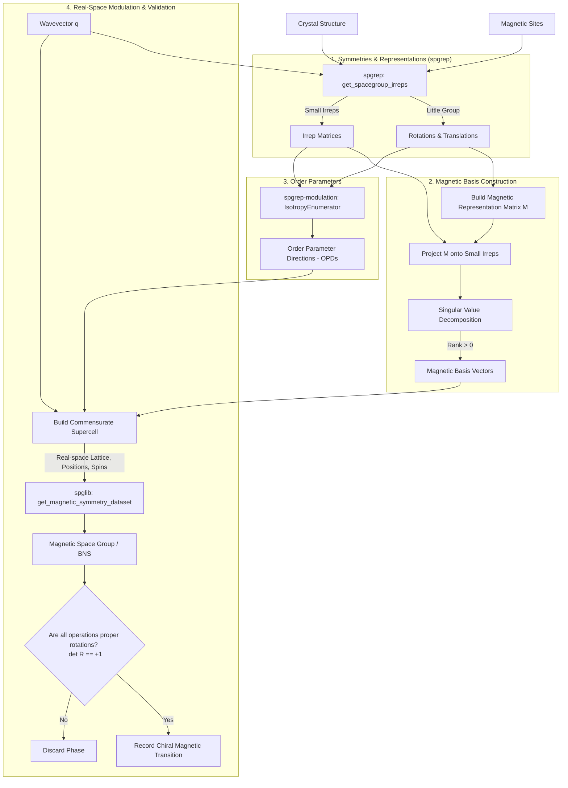
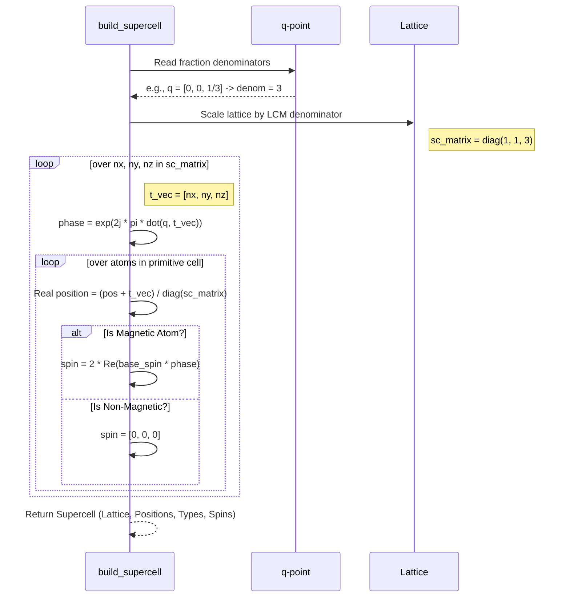

# Magnetic Chiral Phase Transitions

This document provides a highly detailed breakdown of the theoretical background, mathematical equations, software architecture, and the specific implementation details for discovering symmetry-adapted magnetic chiral phase transitions using the `anaddb_irreps` package.

## 1. System Architecture and Workflow

The module processes a crystallographic structure, a list of defined magnetic atomic sites, and a target wavevector ($\mathbf{q}$-point). It evaluates the symmetry breakdown caused by magnetic ordering and identifies resulting configurations that produce **chiral** magnetic space groups.



---

## 2. Mathematical Framework

A phase transition from a paramagnetic parent phase to a magnetically ordered daughter phase is driven by an order parameter. In our context, this order parameter is the magnetic moment distribution $\mathbf{m}(\mathbf{r})$. 

### 2.1. The Pseudo-Vector Nature of Spin
Magnetic moments ($\mathbf{m}$) arise from microscopic current loops. Therefore, they are **pseudo-vectors** (or axial vectors). Under a spatial symmetry operation $g = (R|\mathbf{t})$, a pseudo-vector transforms with an additional sign flip if the operation involves an inversion or mirror. 
$$ \mathbf{m}' = \det(R) \, R \, \mathbf{m} $$

### 2.2. The Magnetic Representation Matrix
For a given wavevector $\mathbf{q}$, we restrict our analysis to the **little group** $G_{\mathbf{q}}$.
Let $N_m$ be the number of magnetic atoms in the primitive unit cell. The magnetic representation $\Gamma_{\text{mag}}$ is formed by a set of $3N_m \times 3N_m$ complex matrices.

For an operation $g = (R|\mathbf{t}) \in G_{\mathbf{q}}$, the transformation of site $j$ to site $k$ in a neighboring unit cell separated by a lattice translation $\mathbf{T}$ defines a $3 \times 3$ block matrix mapping $j \to k$:
$$ M_{k,j}^{(\mathbf{q})}(g) = e^{-2\pi i \mathbf{q} \cdot \mathbf{T}} \det(R) R $$

Here:
* $e^{-2\pi i \mathbf{q} \cdot \mathbf{T}}$ is the Bloch phase shift due to the lattice translation $\mathbf{T}$ required to bring the transformed coordinate back to the reference unit cell.

### 2.3. Projection onto Irreducible Representations
To decompose the $3N_m$-dimensional magnetic space into independent, symmetry-adapted vibrational modes, we project the full representation $M$ onto the $i$-th small irreducible representation $\Delta^{(i)}$ of the little group using the standard character formula:
$$ P^{(i)} = \frac{d_i}{|G_{\mathbf{q}}|} \sum_{g \in G_{\mathbf{q}}} \left( \chi^{(i)}(g) \right)^* M^{(\mathbf{q})}(g) $$
where:
* $d_i$ is the dimension of the irrep $\Delta^{(i)}$.
* $|G_{\mathbf{q}}|$ is the order of the little group.
* $\chi^{(i)}(g) = \operatorname{Tr}(\Delta^{(i)}(g))$ is the character of operation $g$ in the irrep.
* $^*$ denotes complex conjugation.

By performing a **Singular Value Decomposition (SVD)** on $P^{(i)}$, we extract the orthonormal basis vectors $\mathbf{B}^{(i)}$ from the left singular vectors corresponding to non-zero singular values. 

### 2.4. Real-Space Modulation
An **Order Parameter Direction (OPD)**, $\mathbf{c} = (c_1, c_2, \dots, c_{d_i})$, defines a specific linear combination of these basis vectors. The complex base spin $\mathbf{S}_j$ for the $j$-th atom in the reference unit cell is:
$$ \mathbf{S}_j = \sum_{n=1}^{d_i} c_n \mathbf{b}_{j,n} $$

For an atom at position $\mathbf{r}_j$ in a unit cell translated by an integer lattice vector $\mathbf{t}_{\text{cell}}$, the physical, localized real magnetic moment is given by modulating the base spin with $\mathbf{q}$:
$$ \mathbf{m}_j(\mathbf{t}_{\text{cell}}) = 2 \operatorname{Re} \left( \mathbf{S}_j e^{i 2\pi \mathbf{q} \cdot \mathbf{t}_{\text{cell}}} \right) $$
*(The factor of 2 arises from adding the complex conjugate pair to ensure reality, standard in solid-state physics for $\pm \mathbf{q}$ stars).*

---

## 3. Implementation Details

The module `anaddb_irreps/magnetic_transitions.py` contains the `MagneticTransitionFinder` class, which implements the math above in discrete algorithmic steps.

### Step 3.1: Irrep and Little Group Extraction (`spgrep`)
Using `spgrep.get_spacegroup_irreps`, the code extracts the full space group symmetries, identifies the little group $G_{\mathbf{q}}$ mapping `rots_lg` and `trans_lg`, and returns the pre-tabulated irrep matrices (`irreps`).

### Step 3.2: Constructing the Magnetic Representation
The code iterates over the $N_m$ magnetic sites and constructs the $3N_m \times 3N_m$ matrix for each little group operation `num_ops`:
```python
# 1. Transform position
new_pos = np.dot(R, pos_j) + t

# 2. Find mapped atom and translation T
diff = new_pos - positions[map_idx]
translation_diff = np.round(diff) # This is T

# 3. Apply phase and axial R to the 3x3 block
phase = np.exp(-2j * np.pi * np.dot(qpoint, translation_diff))
mat[k*3:(k+1)*3, j*3:(j+1)*3] = phase * (np.linalg.det(R) * R)
```

### Step 3.3: Projection and SVD (`find_magnetic_irreps`)
Instead of a simple Gram-Schmidt process, SVD is highly numerically stable for finding the rank and basis of the projection operator $P$.
```python
P = np.zeros(...)
for g in range(num_ops):
    P += np.conj(chars[g]) * mag_reps[g]
P *= dim / num_ops

u, s, vh = np.linalg.svd(P)
rank = np.sum(s > 1e-4) # Active if rank > 0
basis = u[:, :rank]
```

### Step 3.4: Order Parameter Enumeration (`spgrep-modulation`)
The active irrep matrices and the little group operations are passed to `spgrep_modulation.isotropy.IsotropyEnumerator`. It systematically calculates the invariant vectors (OPDs). For magnetic transitions, we currently filter out continuous (multi-dimensional, unpinned) OPDs and focus on discrete isotropy subgroups.

### Step 3.5: Commensurate Supercell Building (`build_supercell`)

To pass the magnetic configuration to `spglib` for evaluation, the modulated wave must be "unrolled" into a finite, commensurate supercell.



### Step 3.6: Magnetic Space Group Identification and Chirality (`spglib`)

The real-space supercell—equipped with atomic types and real Cartesian spin vectors (`sc_magmoms`)—is evaluated by `spglib.get_magnetic_symmetry_dataset()`.

* **Magnetic Space Group (MSG)**: `spglib` identifies the Belov-Neronova-Smirnova (BNS) magnetic space group, recognizing both the spatial operations and operations coupled with Time-Reversal Symmetry ($\theta$).
* **Chirality Condition**: A structure is chiral if its symmetry group contains *only* orientation-preserving operations. The code iterates through the rotations identified by `spglib`:
  ```python
  def check_chirality(self, dataset) -> bool:
      for r in dataset.rotations:
          if np.linalg.det(r) < 0:
              return False # Inversion, Mirror, or Roto-inversion found
      return True
  ```
If the function returns `True`, the specific irrep and OPD combination is recorded as a valid **chiral magnetic phase transition**.

---

## 4. Usage Examples

You can interface with the magnetic transition module either programmatically through its Python API or via the provided command-line interface (CLI).

### 4.1. Command-Line Interface (CLI)

The package provides a built-in CLI tool `magnetic-chiral`. You must provide a valid crystal structure file (like a POSCAR or CIF, which is parsed by ASE), specify the fractional propagation wavevector (`--qpoint`), and provide a comma-separated list of the 0-based atomic indices that carry a magnetic moment (`--mag-sites`).

```bash
# Example: Find transitions for a magnetic cell at the X point (0, 0, 0.5)
# where atoms 0 and 1 are the magnetic species.
magnetic-chiral --structure POSCAR --qpoint 0 0 0.5 --mag-sites 0,1
```

**Example Output:**
```text
Structure: POSCAR (4 atoms)
Magnetic sites: [0, 1]
q-point: [0.0, 0.0, 0.5]
--------------------------------------------------
Computing magnetic irreps and basis vectors...

================================================================================
CHIRAL MAGNETIC TRANSITIONS
================================================================================
   Irrep |   Dim |                                 OPD | Magnetic Space Group
--------------------------------------------------------------------------------
       2 |     2 |                          [1. 0.] | 18.15 (18.15)
       2 |     2 |                          [0. 1.] | 18.15 (18.15)
```

### 4.2. Python API

If you are building custom workflows, you can import and initialize `MagneticTransitionFinder` directly. 

```python
from ase.io import read
from anaddb_irreps.magnetic_transitions import MagneticTransitionFinder

# 1. Load your parent paramagnetic structure
atoms = read("POSCAR")

# 2. Convert to the format expected by spglib (lattice, scaled_positions, numbers)
cell = (atoms.cell.array, atoms.get_scaled_positions(), atoms.numbers)

# 3. Define the magnetic indices (0-based) and the target q-point
magnetic_sites = [0, 1]
qpoint = [0.0, 0.0, 0.5]

# 4. Initialize the finder
finder = MagneticTransitionFinder(cell, magnetic_sites, symprec=1e-5)

# 5. Calculate all transitions at this q-point
transitions = finder.find_transitions(qpoint)

# 6. Filter and display chiral transitions
print("Chiral Magnetic Transitions found:")
for t in transitions:
    if t['is_chiral']:
        print(f"Irrep: {t['irrep_index']} (Dim {t['irrep_dim']})")
        print(f"  OPD: {t['opd']}")
        print(f"  BNS Number: {t['bns_number']}")
        print(f"  UNI Number: {t['uni_number']}\n")
```

The output list `transitions` contains a dictionary for each valid order parameter direction (OPD) evaluated, carrying its irrep information, vector parameters, the resultant unified magnetic space group ID, the BNS symbol/number, and a boolean explicitly flagging if the resulting phase is chiral.

## 5. Abstract Magnetic Phase Transitions (Structure-less)

You can also compute possible magnetic space group phase transitions purely from group theory—without providing any input crystal structure. 

This is identical in principle to how displacive transitions are computed by `ChiralTransitionFinder`. However, instead of evaluating structural order parameters, it evaluates generic time-odd (magnetic) order parameters transforming according to the abstract space group irreducible representations. 

> **Note:** Because this does not take an input structure, it assumes an arbitrary general magnetic configuration. It cannot guarantee that a given abstract transition is physically achievable by specific magnetic atoms on specific Wyckoff positions (which requires the site-specific magnetic representations covered in Section 3).

### 5.1. The Group Theory Method
If a transition is driven by a time-odd order parameter $\mathbf{c}$ transforming as an irreducible representation $\Delta$, then for any spatial symmetry $g$ in the parent little group:
* If $g$ leaves the order parameter strictly invariant ($\Delta(g)\mathbf{c} = \mathbf{c}$), it becomes a pure spatial symmetry: $(g, 1)$.
* If $g$ inverts the order parameter ($\Delta(g)\mathbf{c} = -\mathbf{c}$), it must be coupled with time-reversal $\theta$ to remain a symmetry of the new phase: $(g, \theta)$.

By constructing a supercell using the fractional denominators of the $\mathbf{q}$-point and grouping these identified operations into purely spatial vs. time-reversed subsets, we can feed the matrices directly into `spglib.get_magnetic_spacegroup_type_from_symmetry` to identify the resultant generic Magnetic Space Group.

### 5.2. Abstract Magnetic CLI Usage

```bash
# Example: Find all abstract chiral magnetic transitions from Space Group 221 at the X point
abstract-magnetic-chiral --spg 221 --qpoint 0 0 0.5 --all
```

**Example Output:**
```text
Parent Space Group: 221
q-point: [0.0, 0.0, 0.5]
--------------------------------------------------
Computing abstract magnetic irreps and subgroups...

================================================================================
ALL MAGNETIC TRANSITIONS
================================================================================
   Irrep |   Dim |   k-type | Magnetic Space Group |   Chiral
--------------------------------------------------------------------------------
       0 |     1 |      1-k |   1008 (    123.348) |       No
       1 |     1 |      1-k |   1020 (    124.360) |       No
...
```

### 5.3. Abstract Python API
You can run this programmatically by importing `AbstractMagneticTransitionFinder`:

```python
from anaddb_irreps.abstract_magnetic import AbstractMagneticTransitionFinder

# Initialize with the Space Group number (1-230)
finder = AbstractMagneticTransitionFinder(spg_number=221, symprec=1e-5)

# Run the purely abstract transition analysis (optionally include multi-k)
transitions = finder.find_transitions(qpoint=[0.0, 0.0, 0.5], include_multi_k=True)

for t in transitions:
    if t['is_chiral']:
        print(f"Irrep: {t['irrep_index']}, BNS: {t['bns_number']}")
```
